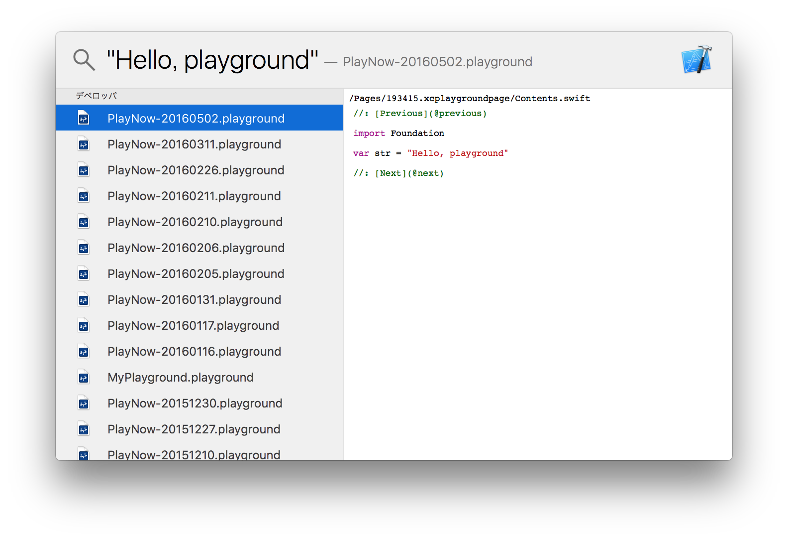

# PlaygroundMDImporter
[](LICENSE)

PlaygroundMDImporter is a Spotlight Importer for Xcode Playground.


*Above screenshot also uses [qlplayground](https://github.com/norio-nomura/qlplayground) for previewing Playground.*

## Requirements
- Xcode 7.3 or later

## Installation

Spotlight Importer Locations are the following:
- Local System: `/Library/Spotlight`
- User Home: `~/Library/Spotlight`

### Using Homebrew-Cask
```sh
$ brew cask install playgroundmdimporter
$ mdimport -r ~/Library/Spotlight/Playground.mdimporter
```

### Manual Install
1. Download [Playground.mdimporter-0.1.0.zip](https://github.com/norio-nomura/PlaygroundMDImporter/releases/download/0.1.0/Playground.mdimporter-0.1.0.zip)
2. Unzip it
3. Copy `Playground.mdimporter` to either Spotlight Importer Locations
4. Ask Spotlight to import by running `mdimport -r /Library/Spotlight/Playground.mdimporter` or `mdimport -r ~/Library/Spotlight/Playground.mdimporter`

### Build By Yourself
```sh
$ git clone https://github.com/norio-nomura/PlaygroundMDImporter.git
$ cd PlaygroundMDImporter
$ xcodebuild install
$ mdimport -r ~/Library/Spotlight/Playground.mdimporter
```

## Author

Norio Nomura

## License

PlaygroundMDImporter is available under the MIT license. See the [LICENSE](LICENSE) file for more info.
